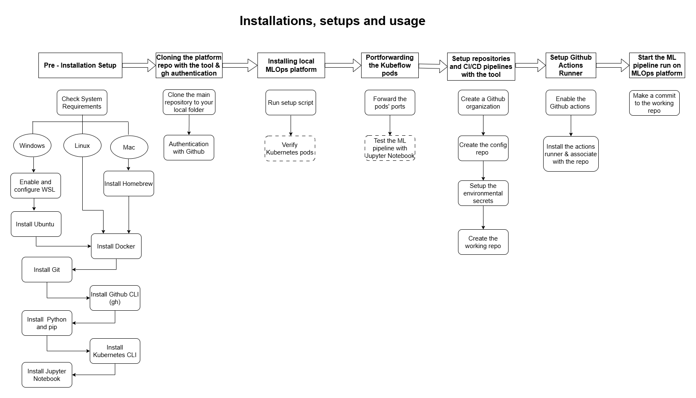
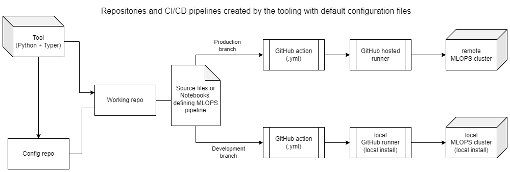

# Installations, setups and usage

**🚀 [Checking all necessary pre-installments](#step-0-checking-all-necessary-pre-installments)**   

**🚧 [Clone the main project repository](#clone-the-main-repository-to-your-local-folder)**

**⚙️ [Step 1: Installing local ML-OPS Platform](#step-1-installing-local-ml-ops-platform)**  
*Troubleshooting the local cluster:* ([link](#some-problem-solving-with-the-local-cluster))

**🔌 [Step 2: Portforwarding the Kubeflow Ports](#step-2-portforwarding-the-kubeflow-ports)**  
*And start the Jupyter Notebook:* ([link](#start-the-jupiter-notebook))

**📁 [Step 3: Creating repositories & Setting up the CI/CD Pipeline](#step-3-creating-the-repositories-and-setting-up-the-cicd-pipeline-with-the-tool)**

**🤖 [Step 4: Installing GitHub Actions Runner](#step-4-enabling-github-actions-and-installing-github-actions-runner)**

**🏁 [Step 5: Starting the run on local ML-OPS Platform](#step-5-starting-runs-on-the-ml-ops-platform-instances)**  
*Including Possible Problems:* ([link](#possible-problems))
******



## Step 0: Checking all necessary pre-installments:

### Pre-installments for each OS

<details>
  <summary>For Windows - before Ubuntu installation</summary>

  - Windows 10 or higher
  - At least 20GB of free disk space  
  - **Enable WSL & Install Ubuntu in order of following steps:**
    
- **Verify WSL is Enabled:**

  <aside>
  
  ***Ubuntu runs on top of WSL***
  
  If WSL isn't enabled, installing Ubuntu won't work as intended - 
  verify that WSL is enabled and properly configured ***before*** installing Ubuntu
  
  </aside>

  - **Check if WSL is enabled**

    Open Command Prompt or PowerShell

    ```bash
    wsl -l -v
    ```

    - If a list of Linux distributions with their version number is displayed (e.g., Ubuntu 2)
      
      ***If version is 2*** - WSL is enabled and you have a distribution installed
      
      ***If version is 1*** - upgrade version to 2, because WSL 2 is required for Docker Desktop
      
      ```bash
      wsl --set-version <DistributionName> 2
      ```

    - If a list of Linux distributions with their version number is ***not*** displayed

      Start button - type PowerShell - right-click Windows PowerShell - Run as administrator

      - Run the following commands

        ```bash
        dism.exe /online /enable-feature /featurename:Microsoft-Windows-Subsystem-Linux /all /norestart
        dism.exe /online /enable-feature /featurename:VirtualMachinePlatform /all /norestart
        ```

      - Restart computer

  - **Check if Ubuntu is installed**

    Open Command Prompt or PowerShell

    ```bash
    wsl -l -v
    ```

    - If Ubuntu appears in the list, Ubuntu is installed correctly
      
      ***If version is 2*** - Ubuntu install & version is correct - proceed to next step
      
      ***If version is 1*** - upgrade version to 2, because WSL 2 is required for Docker Desktop
      
      ```bash
      wsl --set-version Ubuntu 2
      ```

    - If Ubuntu does not appear in the list
      1. Open Microsoft Store
      2. Search for Ubuntu - Install  
  Your Ubuntu installation **must be at least version 24 LTS**.  
    _If your current version is older, please upgrade to meet this minimum requirement._  
      4. Launch the distribution from the Start Menu
      5. Complete the initial setup by creating a UNIX username and password

  - **Install Docker Desktop**

    - **Check if Docker Desktop is installed**

      Look for the Docker icon in the system tray
      
      ***or***
      
      Open Command Prompt / PowerShell

      ```bash
      docker --version
      ```

      - If Docker version is displayed
        
        Docker is installed - skip installation (skip the next step)
        
      - If Docker version is not displayed
        
        Docker is not installed - proceed to installation (proceed to the next step)

    - ***Install Docker for Windows***

      Open the following link in your browser: [https://www.docker.com/products/docker-desktop/](https://www.docker.com/products/docker-desktop/)
      
      - During installation ***select the WSL 2 based engine***

  - **Configure Docker for WSL**

    Open Docker Desktop
    
    Proceed to **Settings - General Tab**
    
    - Ensure that the option "Use the WSL 2 based engine" is selected
    
    Proceed to **Settings - Resources - WSL Integration**
    
    - Configure which WSL 2 distros you want to access Docker from - ***select both options***
      - Enable integration with my default WSL distro
      - Ubuntu
    
    Proceed to **Settings - Resources - Advanced** 
    
    <aside>
    
    Since Docker Desktop with the WSL 2 backend is used, ***resource limits*** (such as memory, CPU, and swap size) are ***managed by Windows via a configuration file instead of Docker Desktop’s built-in settings***
    
    </aside>
    
    - The `.wslconfig` file is located in the Windows user’s home directory.
      
      This file is read by WSL 2 on startup to apply resource limits and other configurations globally, ***regardless of where Docker Desktop itself is installed***
    
    - **Check if `.wslconfig` file exists**

      ```bash
      dir C:\Users\<YourUsername>\.wslconfig
      ```
      
  - **If `.wslconfig` file exists:**
    1. Open the `.wslconfig` file located in `C:\Users\<YourUsername>\.wslconfig`.
    2. Add or update the resource allocations by including the following lines:

       ```bash
       [wsl2]
       memory=10GB
       # Limits the WSL 2 VM to 10 GB of RAM *** (adjust as needed) ***
       ```

  - **If `.wslconfig` file does not exist:**
    1. Create a `.wslconfig` file in your Windows home directory in PowerShell with:
      ```bash
        notepad $env:USERPROFILE\.wslconfig
      ```    
    2. Open the newly created `.wslconfig` file and add the following configuration:
       ```bash
       [wsl2]
       memory=10GB
       # Limits the WSL 2 VM to 10 GB of RAM *** (adjust as needed) ***
       ```      
    3. You can check the that the config file is working by using the following command on the Linux terminal and reading the `Mem total` cell:
       ```bash
       free -h
       ```
             
  </details>
  
  <details>
    <summary>For Linux - Ubuntu </summary>
    
  - **Important:** Your Ubuntu installation **must be at least version 24 LTS**.  
    _If your current version is older, please upgrade to meet this minimum requirement._

  - **Check if Git is installed:**

    - Open your WSL shell or Ubuntu terminal.
    
    ```bash
    git --version
    ```
    - If a version is displayed, Git is installed – proceed to the next step.
    - If not, install Git by running:

      ```bash
      sudo apt update
      sudo apt install git -y
      ```
      
- **Install Additional Tools - Run all of the following commands in your WSL (Ubuntu) terminal**

  - **Ensure curl is installed**
    
      ```bash
      sudo apt update
      sudo apt install curl apt-transport-https -y
      ```
    
  - **Install GitHub CLI (gh):**
 
      ```bash
      sudo apt update
      sudo apt install gh -y
      ```

  - **Install Python (3.11 or later) & pip:**

      ```bash
      sudo apt update
      sudo apt install python3 python3-pip -y
      ```

      Verify the installations:

      ```bash
      python3 --version
      pip3 --version
      ```

  - **Install Kubernetes CLI (kubectl):**

      ```bash
      # Download the latest Kubectl
      curl -LO "https://dl.k8s.io/release/$(curl -L -s https://dl.k8s.io/release/stable.txt)/bin/linux/amd64/kubectl"
      
      # Make it executable
      chmod +x ./kubectl
      
      # Move it to your user's executable PATH
      sudo mv ./kubectl /usr/local/bin/
      ```
  - **Install Kind and kustomize (as of Feb 2025 the platform setup fails with this for Linux and a manual install is recommended):**
   
      ```bash
      curl -Lo ./kind https://kind.sigs.k8s.io/dl/v0.14.0/kind-linux-amd64
      chmod +x ./kind
      sudo mv ./kind /usr/local/bin/kind
      ```

      ```bash
      curl -s "https://raw.githubusercontent.com/kubernetes-sigs/kustomize/master/hack/install_kustomize.sh" | bash -s -- 5.2.1
      chmod +x ./kustomize
      sudo mv ./kustomize /usr/local/bin/kustomize
      ```
      You can verify the installation:

      ```bash
      kind version
      kustomize version
      ```

  - **Install Jupyter Notebook using pip:**

      ```bash
      pip3 install notebook
      ```

      Verify the installation:

      ```bash
      jupyter notebook --version
      ```
</details>

<details>
<summary>For MacOs </summary>
  
- macOS 10.13 or higher
- At least 20GB of free disk space
- Homebrew 
```
/bin/bash -c "$(curl -fsSL https://raw.githubusercontent.com/Homebrew/install/HEAD/install.sh)"
```
- Git 
```
brew install git
```
- GitHub CLI (gh) 
```
brew install gh
```
- Python (3.11 or later)
```
brew install python
```
Verify installation: 
```
python3 --version
pip3 --version
```

- Kubernetes CLI
```
brew install kubectl
```

- Docker  https://docs.docker.com/desktop/setup/install/mac-install/

1. Open Docker Desktop 
2. Go to settings 
3. Go to resources 
4. Increade the disk usage to 20GB


- Jupiter Notebook
```
pip3 install notebook
```
Verify installation: 
```
jupyter notebook --version
```

</details>


### Clone the main repository to your local folder

```
git clone https://github.com/Softala-MLOPS/oss-mlops-platform.git
```


### Set your GitHub credentials (leave in the quotation marks they are required)
```
git config --global user.name "Your Name"
git config --global user.email "your.email@example.com"
```

### Authenticate with GitHub
```
gh auth login
```
> Choose: 
> 1. GitHub.com
> 2. HTTPS
> 3. Yes 
> 4. Login with a web browser 
> 5. Copy the code from the terminal and paste it to the Github 

******

## Step 1: Installing local ML-OPS platform

### Run the setup script in the main repository's folder:

```
./setup.sh
```
> Choose: 
>   1. [5] Standalone KFP and Kserve
>   2. Install local Docker registry? - no
>   3. Install Ray? (It requires ~4 additional CPUs) - no 
>   4. Use recommended Kubernetes version
  

**The installation will take time and some of the pods can get stuck.** 

Checking the status of the pods:

```
kubectl get pods --all-namespaces
```

Ideally all the pods should be running

### Some problem solving with the local cluster


1. Deleting a pod incase of it getting stuck in a crash loop or an error:
```
kubectl delete pod -n <namespace> <pod_name>
```

The guides for this are scattered in here https://github.com/Softala-MLOPS/oss-mlops-platform/tree/main/tutorials/local_deployment but they predate the installer which is prefered to be used.

2. The run might fail at deploy-model step due to wine-quality inference service being already running. This can be solved by deleting the service:

```
kubectl delete inferenceservice wine-quality -n kserve-inference
```

<em><strong>Once you get all the pods running they should start up correctly each time you start the cluster again.</strong></em>

******

## Step 2: Portforwarding the Kubeflow ports

Every time you start up the cluster you have to portforward the ports from inside the containers so they can be accessed from for example your browser.

### Forward the ports

Run in the same terminal window: 
```
kubectl -n mlflow port-forward svc/mlflow 5000:5000
```

Open a new terminal window and run:

```
kubectl port-forward svc/ml-pipeline-ui -n kubeflow 8080:80
```

After this step you should be able to connect to the Kubeflow interface from http://localhost:8080/

### Default credential 
email address is `user@example.com` and the default password is `12341234`.

At this point you can test the cluster with the pipeline in a notebook for the stand alone kfp installation. Separate installation of Jupyter Notebook environment work for running the notebook. Jupyter Notebook installation guide: https://jupyter.org/install

Notebook location (Softala version):
https://github.com/Softala-MLOPS/oss-mlops-platform/blob/main/tutorials/demo_notebooks/demo_pipeline_standalone_kfp/demo-pipeline.ipynb


### Start the Jupiter Notebook

For MacOs and Windows (WSL):
```
jupyter notebook
```

A bit of notebook troubleshooting. Depending on the environment you are running the notebook from the environment might not recognize bash in the very first cell and you might want to try to delete the '%%bash' and add '!' in front of the 'pip install...':

```
!pip install kfp~=1.8.14
```

******

## Step 3: Creating the repositories and setting up the CI/CD pipeline with the tool


### Run the tool on the terminal
-  Navigate to the same level where the oss-mlops-project folder (but have to be outside of a repo folder) is on and run
    
```
oss-mlops-platform/tools/CLI-tool/create_gitrepo_devops_for_ml_work.sh
``` 

1. Enter the organisation name 
2. Enter the name for configuration repository 
- Please use a naming convetion for config repo and working repos  (f.ex. `confJames` and `workJames`) 
3. Create both configuration and working repositories (option 4) 
4. Interactively create config (option 1)
5. Use default Kubeflow endpoint
6. Use default Kubeflow username
7. Use deafult Kubeflow password
8. You can leave remote private key empty 
9. You don't have to specify remote cluster IP
10. You can leave remote cluster username empty 
11. GitHub asks for pasting secrets, you can skip these with `enter` if you were leaving previous steps empty 
12. Enter the name for working repository

### Configuration File

The setup script asks you about configuring GitHub secrets using a config.yaml file. You can choose from options:

1. Create a new configuration file interactively. (Steps 4-11 above)
2. You can use an existing config.yaml inputed by giving a path to it. (For example one interactively and modified by hand)

Example config.yaml:
```
KUBEFLOW_ENDPOINT: "http://localhost:8080"
KUBEFLOW_USERNAME: "user@example.com"
KUBEFLOW_PASSWORD: "12341234"
REMOTE_CLUSTER_SSH_PRIVATE_KEY_PATH: "your/ssh/key/file/path"
REMOTE_CLUSTER_SSH_IP: "192.168.1.1"
REMOTE_CLUSTER_SSH_USERNAME: "user"
```

The scripts sets the secrets on the GitHub organizational level. You can set repository level secrets that take precident over organizational level ones if needed.
If a non-exact path for the SSH key file is passed, the script will search for the file containing the SSH key across the entire user home directory. This can be very slow on a populated drive (e.g. running the install script on bare metal Linux or MacOS).

  ******

## Step 4: Enabling GitHub Actions and Installing GitHub Actions runner

After the repositories are made you may need to enable the GitHub Actions for the working repository. This can be done from the GitHub site by navigating to the working repository and it's Actions tab and clicking the big green button. You also need a local-hosted GitHub Actions runner which is provided by GitHub. The runner is bound to a single GitHub organization or a single repository. It can be changed later, see note at the end of this step.

1. Navigate to your working repo's `Settings` in GitHub web page.
2. Open the `Actions` dropdown menu from the left side of the page under Code and automation.
3. Select the `Runners`
4. Click on the green button that says `New self-hosted runner`
5. Select the appropriate runner image 
   - For Windows select Linux x64 and use the WSL Linux command line
6. Copy and run the commands one by one
7. Afterwards you should have a self-hosted GitHub Actions runner waiting for jobs.

You can restart the runner after the next computer restart by navigating to the runner's `actions-runner/` folder and running:

```
./run.sh
```

**Note about reconfiguring the runner**

If you need to change the repository runners is connected to, you need to either locate to he repository/organization the runner is connected to in GitHub site and remove it (GitHub will give you the script for it) OR delete the *hidden* `.runner` file in the `actions-runner/` folder and redo the step with the new token. *Also do note the runner OS version, don't be like me and try to use the Windows version on Linux.*

**Post setup**



The repository and CI/CD pipelines look like this after the default configuration installation. The staging branch is identical to the production branch. The default files can be found and changed in [CLI-tool/files/](./files/) folder.

******

## Step 5: Starting runs on the ML-OPS platform instances 

To test the notebook-based pipelines: 
- Make a commit that modifies a file in the notebook folder on the choosen branch
- The pipeline will start by executing the notebook-based workflow

To test the source code-based pipelines:
- Make a commit in a scr folder that modifies Python files on the choosen branch
- The pipeline will start by executing the source code-based workflow


> If the change is made on the development branch, it will trigger a run on the local installation <br>
> If the change is on the staging or production branch, it will trigger a run on the full installation

If everything is in order then by pushing to your working repository GitHub should order the runner on your computer to start the run on your local computer's Kubeflow setup.

### Verifying the run and debugging
                                                            
1. Checking GitHub Actions UI:
    - Open the working reposotory and click on Actions tab
    - Find the latest run and check if it has started succesfully
    - If the run failed, open it to check the logs and debug

2. Checking Kubeflow Pipeline UI:
    - Open the Kubeflow instance on [localhost:8080](http://localhost:8080/)
    - Navigate to the Pipelines tab and find the pipeline run triggered by your latest commit
    - Monitor the execution and logs to confirm it is running as expected

3. If the run hasn't started:
    - Verify that the commit was pushed to the correct branch
    - Ensure the GitHub Actions workflow is configured correctly
    - Check the logs in GitHub Actions UI and Kubeflow UI for error messages

### Possible problems
If commit fails due to the wrong python version, go to .github/workflows ->  run-notebook-in-development-environment.yml, and delete this part of the code: 
```

  with:
        python-version: 3.8
```
