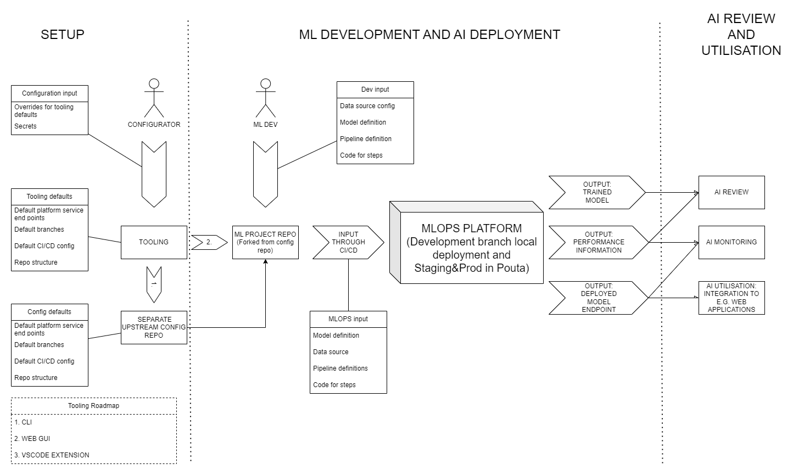

# CLI Tool for GitHub Repository Management
This CLI tool automates the creation, configuration and management of GitHub configurator and working repositories for MLOPS usage. It includes two modules:

1. **Repository Setup Module:** Automates repository creation, branch setup, and configuration
2. **Repository Forking Module:** Fetches repository details and forks them under a specified organization

## Current limitation with the tool

- Tooling works in Unix commandline environments meaning MacOS or Linux (WSL for Windows)
- GitHub authentication via Token and the HTTPS option instead of SSH for the `gh`
	- https://docs.github.com/en/authentication/keeping-your-account-and-data-secure/managing-your-personal-access-tokens#creating-a-personal-access-token-classic
	- https://docs.github.com/en/get-started/getting-started-with-git/caching-your-github-credentials-in-git?platform=linux
 	- Using the copy code from commandline into GitHub's site should work also
- For the tool to be able to fork and rename the working repo correctly a sufficently new `gh` version needed (tested with 2.45.0)
- Environmental secrets are set up currently as GitHub organization level secrets. This means that you may need separate GitHub organizations for difference ML setups.
- Python virtual environments may interfere with GitHub actions runner. (No defined solution for this at the moment)
	- Usage of Python virtual environments is still recommended
- Multiple steps required interacting with GitHub site:
    	- Setting up the organizations
    	- Turning on the GitHub actions for the working repo (Actions tab > Big green button after reading the warnings)
    	- Setting up the self-hosted runner
    	- Setting up the SSH secret for remote cluster access

## Features

### Repository Setup Module

- Create a new GitHub repository in a specified organization
- Clone the repository and initialize it with predefined branches: `development`, `staging`, and `production`
- Copy branch-specific files for different environments
- Set up GitHub secrets using a configuration file (`config.yaml`)
- Set the development branch as the default branch

### Repository Forking Module

- Fetch repository details
- Fork an existing repository under a specified organization with a unique name

## Prerequisites

- For the local installation of the MLOPS platform you need a computer with 16GB RAM with 10GB allocated for Docker to use
	- There is a possibility to use remote virtual machines for the "local installation" of the platform
 	- [Generic remote server installation](./Generic%20guide%20to%20start%20a%20remote%20server.md)
  	- [CSC specific remote server installation](./CSC%20user%20guide.md)
- For Windows machines you also need Linux distro installed via WSL
	- Linux distro should be quite new for Python 3.11 and GitHub CLI 2.45.0
 	- Tested with Ubuntu 24 LTS

## Usage

- You can find more detailed installation and setup guide here: [Installations, setups and usage.md](./Installations,%20setups%20and%20usage.md)

