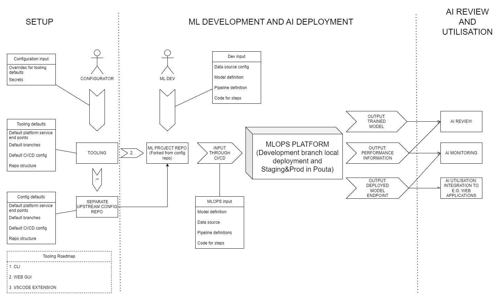

OSS MLOps platform related tooling to be developed:  

0) aim:
- tool creates a setup in which data scientist can do ML development and AI deployment through software practices easily
- the setup involves a git repo in GitHub

1) development roadmap (done as much as time allows in this order):
- (A) CLI tool to setup the repo locally and to push it to GitHub (setting up the CI/CD and secrets there also)
- (B) WebApp tool to do the same as CLI using the CLI tool in the backend (perhaps this should be aligned with point (C) to help its later development)
- (C) VSCode extension to do the same as CLI using the CLI tool in the background

2) functionality:
- use default settings but ask for changes
- setup repo structure and branches (create locally, push to GitHub with given credentials)
- setup ci/cd
- setup secrets (for both the platform and data source access etc.)
- setup could rely on 2 paths: 1. tools could establish a "main" repo with some configs, 2. tool could establish ML project repos by forking the main repo (this way any configuration updates could propagated to all ML project repos by just pulling configuration updates done to a main repo from which they have been forked)

------

Ml repo structure and setup (1-3) to be created by the tool:

1) branches:
- development
- staging
- production

2) file & dir structure:
- data/: data or configuration that points to data (like the one used in pull_data step in the example pipeline)
- notebooks/: Jupyter notebooks for interactive use of pipeline and additional explanations about the steps
- src/: source code for the project, including file that define pipeline steps regarding data processing, model training and evaluation
- src/steps: for code with functions that define steps in the pipeline
- src/pipelines: for all the different pipeline definition code and configuration files
- src/pipelines/<branch name>/main.py: main pipeline and its configuration (endpoint URLs etc.) for a CI/CD pipeline related to a branch
- src/helpers: all support code
- models/: saved models (and model "checkpoints") or configuration that points to where the models reside (like URL referring to MLflow/minio in the platform)
- tests/: unit tests for your code, also code for running inference tests against deployed models
- docs/: documentation for the project
- README.md: Overview of the repo, including setup instructions and crucial configuration file locations, where to put code for pipeline steps and pipeline definition, and examples.
- requirements.txt or environment.yml: List of dependencies required for the project.
- .gitignore: specifies which files and directories to ignore in the repository.
- LICENSE: license for the Project (put in place but left empty and with instructions to fill it out with some options to consider)

3) CI/CD pipelines (GitHub actions)
- for each branch: own CI/CD pipeline and configuration files in repo - credentials as secrets and not in repo
- each pipeline submits kfp pipelines to some instance of OSS MLOps platform
- in real life those instances could be separate
- during the course:
  - "development" branch CI/CD pipeline could submit to your locally installed platform
  - "staging" and "production" branches CI/CD pipelines could submit to platform installed to CSC
- each CI/CD pipeline constructs and submits kubeflow pipeline to its configured platform instance
- that includes testing access to data (and potential previous model versions - which is not part of example pipeline) before submitting kf pipeline

Documentation needed:
- documentation to code (both for tool code in OSS MLOps platform repo and for the repos generated by the tool)
- readme (for tool part of OSS MLOps platform repo and for the repos generated by the tool)
- an example repo generated with the tool regarding the example pipeline
- example videos regarding both
  - the use of the tool to generate the repo and
  - using the generated repo by putting example pipeline code in place there and running the pipeline (through CI/CD and KubeFlow Pipelines on OSS MLOps platform) by doing git commit to the generated repo

------

